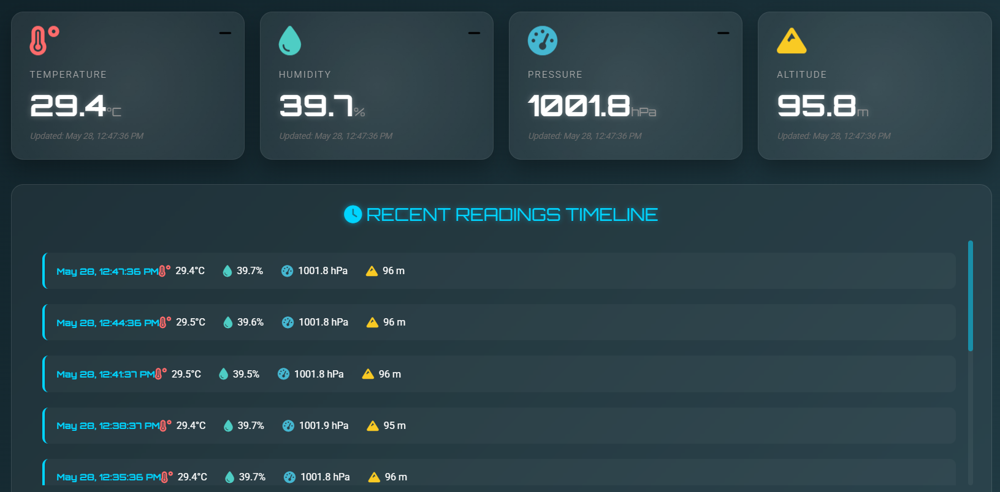

# 🌤️ IoT Weather Station

Professional weather monitoring system using ESP8266 and BME280 sensor with cloud dashboard.

## Features

- ✅ Real-time temperature, humidity, pressure monitoring
- ✅ Cloud data storage (MySQL)
- ✅ Beautiful animated dashboard
- ✅ WiFi configuration portal
- ✅ Historical charts and trends
- ✅ Mobile responsive

## Components

- ESP8266 NodeMCU (ESP-12E)
- BME280 Sensor
- Web hosting with PHP & MySQL

## Quick Start

1. **Arduino Setup**: Upload `arduino/weather_station.ino` to ESP8266
2. **Server Setup**: Upload files from `server/` folder to your web host
3. **Dashboard**: Upload `dashboard/index.html` to your web host
4. **Configure WiFi**: Connect to `Haneef_Weather_Setup` hotspot

## Documentation

Full tutorial available at: haneefputtur.com/weather-station

## License

MIT License - Feel free to use and modify!

## Author

Haneef Puttur - www.haneefputtur.com
